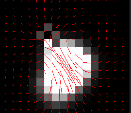

# Fluid_Simulation
### I stumbled upon [this](https://www.youtube.com/watch?v=qsYE1wMEMPA) video, and the guy in it says that after watching it an experienced programmer will be able to implement the simulation. I, being an "experienced and highly skilled, first class, one of a kind programmer" took it personally, and there is the fruit of my 4 days long suffering(use main.py to launch) (fluid_with_numba_2_0.py is the location of the fluid class that runs at 60 fps)
    A couple of examples:
    
    

